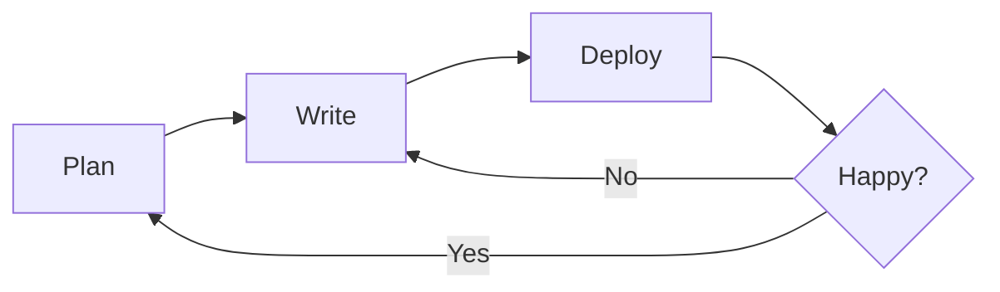

# ✨ Modern MkDocs Template

Welcome to your new documentation site! This template is pre-configured with the best plugins and extensions for a professional experience.

---

## 🚀 Key Features

- 🌓 **Dark Mode** support is built-in and follows system preferences by default.
- 📱 **Mobile Friendly** design that looks great on any screen.
- 🔍 **Instant Search** with highlighting and suggestions.
- 📊 **Mermaid Diagrams** for flowcharts, sequences, and more.
- 🔡 **Latex Math** support via Arithmatex.

---

## 📝 Markdown Examples

### 💡 Admonitions

!!! tip "Pro Tip"
    Use admonitions to highlight important information. They come in various flavors like `note`, `abstract`, `info`, `tip`, `success`, `question`, `warning`, `failure`, `danger`, `bug`, and `example`.

### 📑 Content Tabs

=== "Python"
    ```python
    def welcome():
        print("Welcome to MkDocs Material!")
    ```

=== "JavaScript"
    ```javascript
    function welcome() {
        console.log("Welcome to MkDocs Material!");
    }
    ```

### 📉 Diagrams



### 🔢 Math Equations

When $a \ne 0$, there are two solutions to \(ax^2 + bx + c = 0\) and they are
$$x = {-b \pm \sqrt{b^2-4ac} \over 2a}$$

### ✅ Task Lists

- [x] Create project
- [x] Configure extensions
- [ ] Write documentation
- [ ] Profit!

### 🎨 Icons & Emojis

- :material-rocket-launch: Built for speed
- :fontawesome-brands-github: Open source
- :octicons-device-camera-video-24: Media friendly
- :smile: :fire: :heart:

---

## 🛠️ Getting Started

1. **Install dependencies**:
   ```bash
   pip install -r requirements.txt
   ```

2. **Run locally**:
   ```bash
   mkdocs serve
   ```

3. **Build site**:
   ```bash
   mkdocs build
   ```
